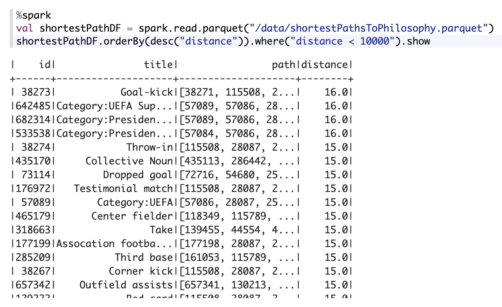
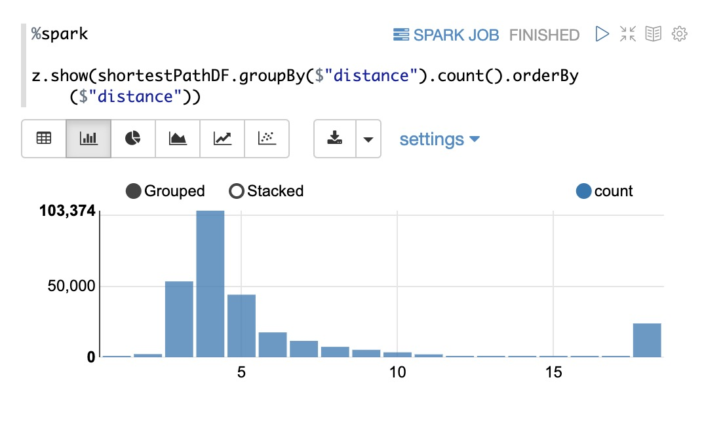
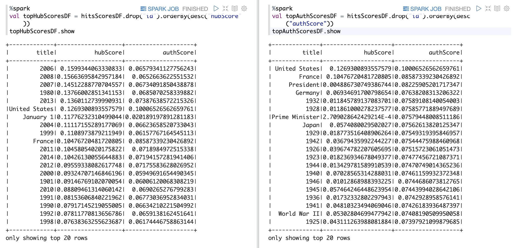
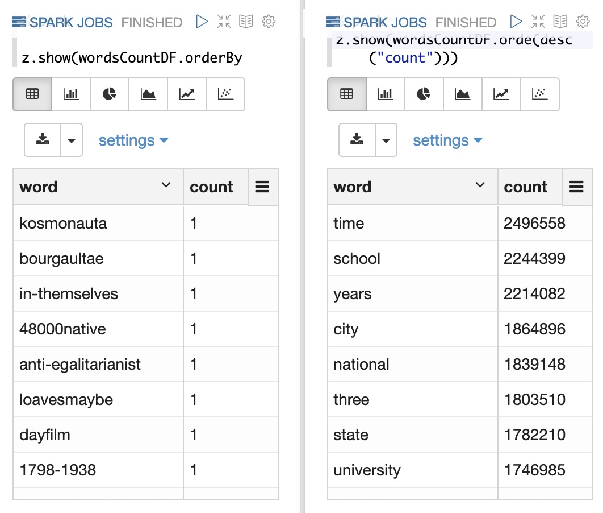
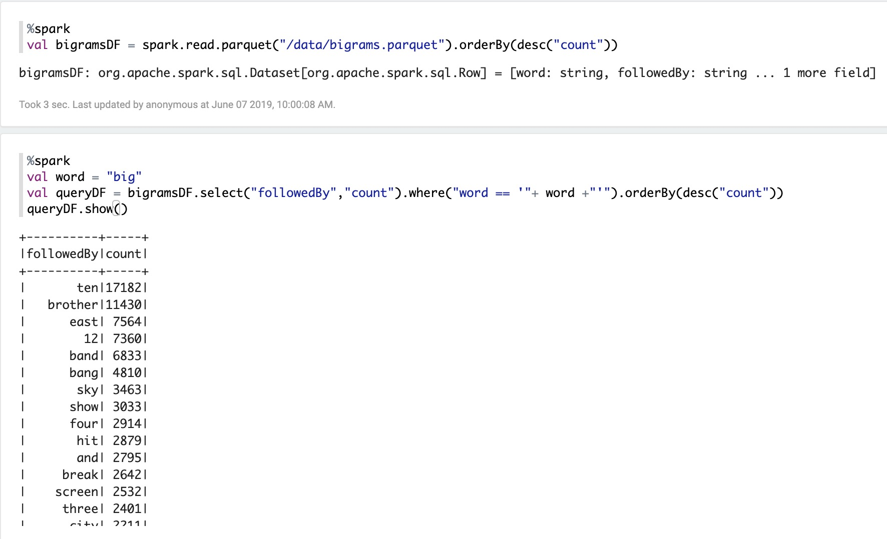

# wikilosophy-BDA

***Ludovic Gindre & Raed Abdennadher & Edward Ransome***

***

## 1. Dataset

Dans ce projet, nous avons utilisé la base de données des articles *Wikipédia* jusqu'au **1er janvier 2019**. Cette base de données est sous forme d'un fichier `xml` compressé en format `bzip2`. La taille de ce fichier est **16,7Go**. La structure `xml` de ce fichier est la suivante:

```xml
<page>
    <title>...</title>
    <ns>...</ns>
    <id>...</id>
    <revision>
        <id>...</id>
        <parentid>...</parentid>
        <timestamp>...</timestamp>
        <contributor>
            <username>...</username>
            <id>...</id>			
        </contributor>
        <comment>...</comment>
        <model>...</model>
        <format>...</format>
        <text>...</text>
        <sha1>...</sha1>		
    </revision>	
</page>
```

Avec ce fichier, on a son index. C'est un fichier texte contenant `n` lignes, avec `n` le nombre total des pages de Wikipédia. Chaque ligne est sous la forme suivante:

```
offset:pageId:pageTitle
```

* `offset`: représente l'offset (en octets) dans le fichier de base, à partir duquel on trouve la page ayant l'identifiant `pageId`
* `pageId`: représente l'identifient de la page
* `pageTitle`: représente le titre de la page


Pour récupérer le contenu d'une page, il faut créer une petite partition en utilisant la commande shell `dd`, décompresser cette partition, et chercher séquentiellement la page en utilisant son `id`.

Exemple: pour récupérer le contenu de la page ***ASCII***, il faut créer une partition à partir de l'offset **615** jusqu'au l'offset **644151** du fichier de base, décompresser cette partition, puis la parcourir séquentiellement pour arriver à la page ***ASCII***

## 2. Description des features utilisés et du prétraitement événtuel pour extraire des features

L'information la plus utile dans notre cas est les **liens** dans les articles. Pour commencer, nous avons eu besoin d'extraire le texte des articles de Wikipédia depuis le dump. Cette étape nécessite la décompression partielle de ce dernier, car on peut pas charger tout le fichier dans la mémoire au moment de l'exécution. Pour ce faire, nous avons utilisé le fichier index. La procédure est la suivante :

- Récupérer l'offset depuis l'index

- Décompresser la partie à partir de cet offset jusqu'au prochain offset du dump utilisant la commande `dd` depuis notre programme Scala (`Process(bash_command).!`). On récupère ainsi 1OO articles Wikipédia en XML

- Parser les articles (le XML) utilisant (XMLEventReader) fourni par Scala et récupérer le contenu des articles

- Pour chaque article, récupérer la liste des liens inter-page. Les liens peuvent être sous différentes formes :

  - `[[pageName]]`
  - `[[pageName|The Page]]`
  - `[[pageName|The [[otherpage|Page]] page]]`

  On enregistre ces informations sous la forme suivante :

  ```
  pageName:\tPage1;;Page2;;Page3;;…
  ```
  


Dans un deuxième lieu, on applique un deuxième passage sur nos données produites (chaque page avec ses liens) pour les nettoyer. Chacune de ces pages doit dans l'index. Si ce n'est pas le cas, on la supprime. Ensuite, on construit un dictionnaire depuis l'index `Map(title:String => id:Int)`. Cette transformation nous sera utile pour remplacer les titres des pages par les ids.

Finalement, on produit un fichier contenant des lignes sous la forme `id: id id id id ...`. On a choisit ce format pour que notre fichier soit lisible depuis **GraphX** plus tard. 


Nous stockons aussi un fichier permettant de facilement récupérer le titre de la page en fonction de son ID que nous utiliserons plus tard avec **GraphX**.


## 3. Questions d'analyse

- Calculer le chemin le plus court entre deux pages
- Quels sont les plus grand Hub (page avec le plus grand nombre de liens sortants) et les plus grandes Autorité (page avec le plus grand nombre de liens entrants).
- Quels sont les mots les plus utilisés sur Wikipédia (Stop-words exclus)
- Fournir le mot suivant le plus probable d'un mot donné

## 4. Algorithmes appliqués
### Hyperlink-Induced Topic Search (HITS)
Pour calculer les autorités et les hubs, nous utilisons l'algorithme HITS. De manière itérative, chaque page est fournie un score de "hub" et un score "autorité" qui augmente pour chaque lien sortant/entrant. Les scores sont normalisés pour qu'ils convergent.

## 5. Optimisations
Aucune optimisation particulière.

## 6. Démarches de test et évaluation
Avant d'effectuer chaque algorithme sur l'entièreté de Wikipédia, nous avons testé la chose sur le dump du "Simple English Wikipedia" (145'000 articles comparé au 5'800'000 de Wikipedia anglais). Ceci assure des temps de calcul plus raisonnables pour s'assurer du bon fonctionnement avant de consacrer beaucoup de temps de calcul au plus grand dataset.

Les plus gros hubs ont été visités manuellement pour s'assurer qu'il s'agit de pages contenant beaucoup de liens, mais aucun autre teste n'a vraiment pu être effectué pour cette étape. Pour les autres étapes, les résultats n'ont pas pu être testés.

## 7.  Résultats

### Simple English Wikipedia
Les deux premiers algorithmes n'ont malheureusement pas pu être tournés sur le graphe de Wikipedia anglais. Malgré l'utilisation d'un cluster de quatre machine à 32GB de mémoire avec un tas JVM configuré à 28GB, nous avons tout de même obtenu une exception ```java.lang.OutOfMemoryError: Java heap space```. Bien que le parsing et nettoyage ont été effectués sur les données, elles n'ont malheureusement pas pu être chargées dans un graphe.

#### Chemin le plus court
Le chemin le plus court nécessite un calcul de tous les chemins pour une destination donnée: nous avons effectués le calcul avec la page "Philosophy" pour exemple. Voici les chemins les plus longs vers cette page:



Voici toutes les distances vers cette page:




#### Hubs, authorities
L'algorithme HITS est appliqué avec 5 itérations avec un score de 1 de base. Le résultat est un tableau contenant pour chaque ID de page son score "authority" et "hub". On peut voir les plus grands scores des deux catégories:



Les plus grands hubs sont quasiment uniquement des dates, avec parfois des pages de pays. Les pages contenant des dates aggrège tous les événements importants se passant à cette date et ont donc énormément de liens sortants. Il n'est donc pas étonnant que ces pages soient les plus grands hubs. On pourrait dire que la date la plus importante (la date à laquelle il s'est passé le plus d'évenemnts notables) est le 1 Janvier, et l'année la plus importante est 2006.

Les autorités, elles, sont presques identiques aux hubs. Ceci est dû à la nature de Wikipédia: la page d'un évenement se passant à une certaine date va contenir cette date, et donc quasiment tous ces liens sont bidirectionels.


### English Wikipedia
#### Parsing
Le parsing a pu être effectué même si il n'a pas pu être utilisé dû aux problèmes de mémoire décrits plus haut. Le fichier contenant les arêtes du graphe à une taille de 1.8GB décompressé, et le fichier contenant les ID des pages fais 670MB décompressé.

#### Mots les plus utilisés
Les mots les plus utilisés sont stockés et peuvent être chargés dans un Dataframe. On peut ensuite faire des requêtes pour voir le nombre d'occurences d'un mot particulier, ou regarder les mots les plus/moins utilisés:


Les stopwords sont filtrés pour éviter qu'ils remplissent le tableau des mots les plus utilisés. On peut voir que les mots avec une seule occurence sont très particuliers, peut-être des fautes de frappe, mais souvent des mots inexistants.


#### Bigrammes
Tous les bigrammes et leurs nombre d'occurences sont stockés, il suffit d'effectuer une requête sur le dataframe. Par exemple, si on veut voir si le mot "data" apparaît souvent après "big", on peut effectuer la requête:



On peut voir qu'il n'apparait pas dans la liste: il y a une très faible probabilité que "data" suive le mot "big" dans tout Wikipédia.


## 8. Propositions d'améliorations

Pour le parsing XML, nous effectuons des manipulations mémoire avec la commande de copie 'dd' pour extraire des pages. Ceci nous empêche d'utiliser entièrement Spark pour le parsing et nous force à copier une partie, la traiter, puis effacer sur le disque avec des commandes bash. Nous n'avons pas trouver un moyen d'extraire à partir d'un RDD un morceau d'une taille spécifique à un offset pour le traiter dans un autre RDD. Le parsing est donc assez lent (30h sur un laptop pour l'entièreté de Wikipedia anglais). 
