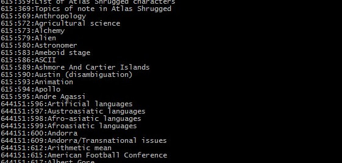
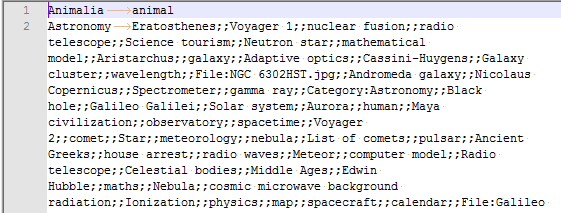
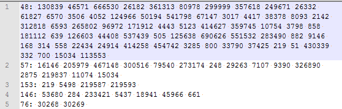
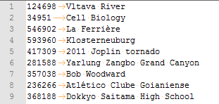

# wikilosophy-BDA

***Ludovic Gindre & Raed Abdennadher & Edward Ransome***

***

## 1. Dataset

Dans ce projet, nous avons utilisé la base de données des articles *Wikipédia* jusqu'au **1er janvier 2019**. Cette base de données est sous forme d'un fichier `xml` compressé en format `bzip2`. La taille de ce fichier est **16,7Go**. La structure `xml` de ce fichier est la suivante:

```xml
<page>
    <title>...</title>
    <ns>...</ns>
    <id>...</id>
    <revision>
        <id>...</id>
        <parentid>...</parentid>
        <timestamp>...</timestamp>
        <contributor>
            <username>...</username>
            <id>...</id>			
        </contributor>
        <comment>...</comment>
        <model>...</model>
        <format>...</format>
        <text>...</text>
        <sha1>...</sha1>		
    </revision>	
</page>
```

Avec ce fichier, on a son index. C'est un fichier texte contenant `n` lignes, avec `n` le nombre total des pages de Wikipédia. Chaque ligne est sous la forme suivante:

```
offset:pageId:pageTitle
```

* `offset`: représente l'offset (en octets) dans le fichier de base, à partir duquel on trouve la page ayant l'identifiant `pageId`
* `pageId`: représente l'identifient de la page
* `pageTitle`: représente le titre de la page



Pour récupérer le contenu d'une page, il faut créer une petite partition en utilisant la commande shell `dd`, décompresser cette partition, et chercher séquentiellement la page en utilisant son `id`.

Exemple: pour récupérer le contenu de la page ***ASCII***, il faut créer une partition à partir de l'offset **615** jusqu'au l'offset **644151** du fichier de base, décompresser cette partition, puis la parcourir séquentiellement pour arriver à la page ***ASCII***

## 2. description des features utilisés et du prétraitement événtuel pour extraire des features

L'information la plus utile dans notre cas est les **liens** dans les articles. Pour commencer, nous avons eu besoin d'extraire le texte des articles de Wikipédia depuis le dump. Cette étape nécessite la décompression partielle de ce dernier, car on peut pas charger tout le fichier dans la mémoire au moment de l'exécution. Pour ce faire, nous avons utilisé le fichier index. La procédure est la suivante :

- Récupérer l'offset depuis l'index

- Décompresser la partie à partir de cet offset jusqu'au prochain offset du dump utilisant la commande `dd` depuis notre programme Scala (`Process(bash_command).!`). On récupère ainsi 1OO articles Wikipédia en XML

- Parser les articles (le XML) utilisant (XMLEventReader) fourni par Scala et récupérer le contenu des articles

- Pour chaque article, récupérer la liste des liens inter-page. Les liens peuvent être sous différentes formes :

  - `[[pageName]]`
  - `[[pageName|The Page]]`
  - `[[pageName|The [[otherpage|Page]] page]]`

  On enregistre ces informations sous la forme suivante :

  ```
  pageName:\tPage1;;Page2;;Page3;;…
  ```
  


Dans un deuxième lieu, on applique un deuxième passage sur nos données produites (chaque page avec ses liens) pour les nettoyer. Chacune de ces pages doit dans l'index. Si ce n'est pas le cas, on la supprime. Ensuite, on construit un dictionnaire depuis l'index `Map(title:String => id:Int)`. Cette transformation nous sera utile pour remplacer les titres des pages par les ids.

Finalement, on produit un fichier contenant des lignes sous la forme `id: id id id id ...`. On a choisit ce format pour que notre fichier soit lisible depuis **GraphX** plus tard. 



Nous stockons aussi un fichier permettant de facilement récupérer le titre de la page en fonction de son ID que nous utiliserons plus tard avec **GraphX**.




## 3. Questions d'analyse

- Calculer le chemin le plus court entre deux pages
- Quels sont les plus grand Hub (page avec le plus grand nombre de liens sortants) et les plus grandes Autorité (page avec le plus grand nombre de liens entrants).
- Quels sont les mots les plus utilisés sur Wikipédia (Stop-words exclus)
- Fournir le mot suivant le plus probable d'un mot donné

## 4. Algorithmes appliqués

## 5. Optimisations


## 6. Démarches de test et évaluation

## 7.  Résultats

## 8. Propositions d'améliorations

Pour le parsing XML, nous effectuons des manipulations mémoire avec la commande de copie 'dd' pour extraire des pages. Ceci nous empêche d'utiliser entièrement Spark pour le parsing et nous force à copier une partie, la traiter, puis effacer sur le disque avec des commandes bash. Nous n'avons pas trouver un moyen d'extraire à partir d'un RDD un morceau d'une taille spécifique à un offset pour le traiter dans un autre RDD. Le parsing est donc assez lent (30h sur un laptop pour l'entièreté de Wikipedia anglais). 
